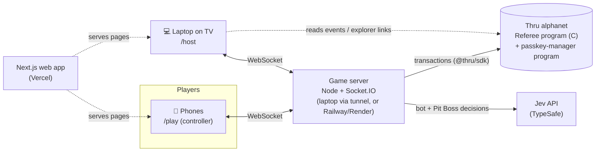
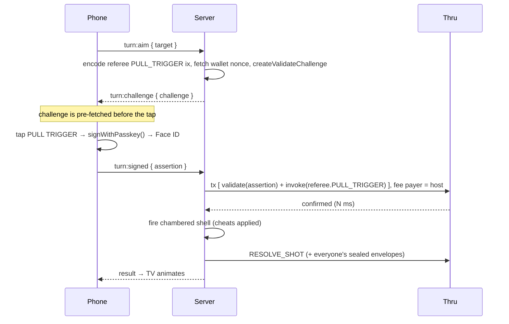

# BLANK CHECK — Build Spec

> **Everyone cheats. The chain remembers.**
>
> A Jackbox-style party game inspired by Buckshot Roulette. Your laptop plays on the TV, and everyone's phone is their controller. Face ID pulls the trigger. Cheating is allowed. Getting caught costs you. A referee program written in C and running on the Thru blockchain keeps sealed evidence of every cheat. At the end, **Review the Tape** replays the whole game from the chain and exposes every cheat nobody caught.

**Hackathon track:** Unto Labs, "Best Use of Thru". Judged on creativity, meaningful Thru integration, technical depth, and "wow" or comedy.
**AI opponents:** Jev by TypeSafe AI (bots and the "Pit Boss").
**Spec version:** v1 (Sept 19, 2026). Thru and Jev API details were checked against their docs that day.

---

## 0. How to use this doc with an AI coding agent

Give your agent this whole file as the project brief. Then install these tools so it can check the real APIs instead of guessing.

```bash
# Thru's official agent skill ("thru-best-practices")
npx skills add https://thru.org

# Thru Explorer MCP (lets the agent inspect blocks, transactions, accounts, and ABIs)
claude mcp add --transport http thru-explorer https://scan.thru.org/api/mcp

# TypeSafe / Jev agent skill (Claude Code)
claude plugin marketplace add typesafe-ai/skills
claude plugin install typesafe@typesafe-ai
```

**Ground rules for the agent:**

1. **The game rules in §2–§3 are the source of truth.** Don't change them without asking.
2. **Thru is pre-1.0 and its APIs change often.** Any function name in this doc marked **(verify)** must be checked against `https://thru.org/docs/...` (append `.md` to any docs URL to get clean markdown) before you use it. Pin package versions once something works.
3. **Keep a `MockReferee`.** The game has to be fully playable with no blockchain at all, so gameplay work is never blocked on chain work (see §7.1).
4. **Never leak private state.** The TV and each phone only ever receive the slice of state they're allowed to see (see §9.3).
5. **TypeScript and C hashing must match byte for byte.** Write test vectors (see §6.5).
6. Build in the phase order in §11. Every phase ends with something playable.

---

## 1. The pitch

### 1.1 In one breath
Up to 6 players (humans plus AI bots) sit at a virtual table on the TV. There's a shotgun loaded with LIVE and BLANK shells in a hidden order. On your turn you shoot yourself or someone else, and you confirm the shot with Face ID. Everyone has 3 ❤️, and the last player standing wins. Every round, each player also gets a secret **cheat card** on their phone. Anyone can slam the **RIGGED!** button to accuse someone. When they do, the accused player's sealed evidence is opened on-chain: if they cheated, they lose a heart; if they didn't, the accuser loses one.

### 1.2 Why this is the right "blockchain" idea
We don't bolt a blockchain onto a game. **The whole game is about cheating, and a game about cheating needs a referee nobody controls, not even the host.** That's the one job a blockchain is actually built for.

- **Sealed evidence:** Evidence of every cheat is sealed on-chain *before* anyone accuses anyone. Nobody can edit it afterward, not a player and not our server.
- **Public verdicts:** Verdicts are computed by a public program, not by our server's say-so.
- **A verifiable replay:** **Review the Tape** is rebuilt from chain data, and anyone can re-check it on the explorer.
- **Only possible on a fast chain:** Every trigger pull, every sealed envelope, and every accusation is an on-chain transaction. On a slow chain that would wreck a party game. On Thru, nobody at the table should notice (verify the actual latency early; see §12).

### 1.3 How we score on each judging criterion

| Criterion | What we show |
|---|---|
| Creativity | Cheating is a legal mechanic, the blockchain is the pit boss, and the finale is a VHS-style "Review the Tape" |
| Meaningful Thru integration | Face ID passkey wallets (no seed phrase, no extension, no app install), a C referee program on Thru's RISC-V VM, commit-reveal evidence, on-chain hearts and verdicts, and a replay built from chain data |
| Technical depth | Commit-reveal with salted SHA-256, decoy envelopes so cheaters look like everyone else, passkey signatures checked by the passkey-manager program then passed on to our program (CPI), AI agents as on-chain players, and hashing that matches byte for byte between TypeScript and C |
| Wow / comedy | "Confirm with your face to pull the trigger," the RIGGED! slam, the envelope-opening drama, and the tape exposing your friends |

### 1.4 The question judges will ask: "Couldn't a normal server do this?"
> A normal server could hold the evidence, but then the host could open it, change it, or delete it, and the replay would just be "trust me." Here, every envelope is sealed on-chain before anyone is accused, the verdict comes from a public program, and the tape is rebuilt from the chain, so anyone can verify it. Face ID *is* the player's wallet. And it's only playable as a party game because Thru is fast enough to put every shot on-chain without anyone waiting.

**Be honest about the trust model:** in the MVP, our server is the dealer. It knows the shell order and writes the envelopes. The chain stops it from *rewriting history*, but it doesn't stop it from lying at the moment of sealing. The stretch goal in §6.8 (phones seal their own envelopes) closes that gap. Say this out loud if a judge pushes; they'll respect it.

---

## 2. Game rules (final)

### 2.1 Setup
- **Players:** 2–6 seats, any mix of humans (phones) and Jev bots.
- **Hearts:** Everyone starts with **3 ❤️**. This is configurable; demo mode uses 2.
- **No chips, no tokens, no betting. Hearts are the only currency.**
- **Winning:** The last player with hearts wins. At 0 hearts you're eliminated and become a 👻 spectator.

### 2.2 A round
1. **Load:** The dealer loads the shotgun with 2–8 shells, and the TV announces the count, e.g. **"3 LIVE · 2 BLANK"**. The order is secret. Its hash is committed on-chain before the first shot.
2. **Deal:** Every living player gets **1 secret cheat card** on their phone (see §3.3). Use it or lose it: unused cards are discarded when the round ends.
3. **Play turns** (§2.3) until the gun is empty or only one player is left alive.
4. **Last Call:** Once the gun is empty, there's a 5-second window where anyone can still call RIGGED! for this round.
5. Reload for the next round. The first shooter is the next living player after whoever fired the last shot.

### 2.3 A turn
1. The active player picks a target on their phone: **YOU** or any living player.
2. They tap **PULL TRIGGER**, which brings up Face ID.
3. The chambered shell fires, after any cheats that were played on it:
   - **LIVE:** the target loses 1 ❤️.
   - **BLANK, aimed at yourself:** you shoot again (the risky bonus from Buckshot Roulette).
   - **Anything else:** the turn passes clockwise to the next living player.
4. Right after every shot, every player's envelope is sealed on-chain (see §3.2).

### 2.4 RIGGED!
- At any time during a round, a living player can hit **RIGGED!**, pick another living player, and confirm with Face ID.
- **One accusation per player per round.**
- **Verdict:** The accused player's envelopes for *this round* are opened on-chain.
  - **GUILTY** (they played a cheat card this round): the accused loses 1 ❤️ and is marked **BUSTED** for the rest of the round, which means nobody can accuse them again this round (no pile-ons).
  - **INNOCENT:** the accuser loses 1 ❤️.
- A verdict can eliminate someone, including the accuser.
- After the verdict, play resumes with the same active player.

### 2.5 End of game → Review the Tape
When one player is left, the TV switches to **Review the Tape** (§4.3). Every remaining envelope and every sealed shell order is revealed and checked against the chain, and every cheat nobody caught is replayed on screen. Then the awards.

---

## 3. Cheating, explained simply

### 3.1 Everyday version: sealed envelopes
Picture a glass box in the middle of the table.

- **After every shot, every player drops one sealed envelope into the box.** Everyone can see the envelopes pile up. Nobody can open them.
- If you **cheated** since the last shot, your envelope says what you did: *"Seat 3 played HOT LOAD on shell #4."*
- If you **didn't**, your envelope says *"nothing."*
- **Everyone drops one every time**, so you can't spot a cheater by watching who drops envelopes. Cheaters and honest players look exactly the same.
- When someone yells **RIGGED!** at you, your envelopes from this round are opened in front of everyone. You can't swap them for clean ones, because they've been sitting in the glass box the whole time.

### 3.2 The same thing in tech terms
| Party version | Tech version |
|---|---|
| Glass box | Our referee program's `Table` account on Thru |
| Sealed envelope | `SHA-256(table_address, round, window, seat, cheat_code, shell_index, salt)`, a 32-byte hash |
| "Nothing" envelope | The same hash with `cheat_code = NONE` (a decoy) |
| Opening an envelope | Posting the original contents plus the salt; the program re-hashes them and checks the result matches the stored hash |
| Can't swap envelopes | Once a hash is on-chain it's fixed, and different contents can't produce the same hash |

**Why the salt?** Without it, anyone could hash all 5 possible messages ("nothing," "PEEK," "HOT LOAD," and so on) and see which one matches. The salt is a random 32-byte secret generated per envelope, and it makes each envelope impossible to guess until it's opened.

**Why would a cheater's envelope honestly say they cheated?** Because the only way to cheat is to *play a cheat card through the game*, and the game writes it down when you do. You're not hacking the game; you're using a cheat the game allows and hoping nobody calls you on it. The blockchain's job isn't to prevent cheating (cheating is the game). Its job is to make cheating **provable**: nobody can change the record afterward, and the verdicts and the tape are publicly checkable.

### 3.3 Cheat cards (MVP set)
You can play your card **at any time during the round**, including on *someone else's* turn (that's where the fun is). Cheats never need Face ID, because raising your phone to your face would give you away. They're a silent long-press.

| Card | Effect | Leaves a footprint? |
|---|---|---|
| 👁 **PEEK** | Your phone privately shows whether the chambered shell is LIVE or BLANK | No, but players who shoot themselves with too much confidence look suspicious |
| 🔴 **HOT LOAD** | The chambered shell becomes **LIVE** | **Yes**, if it was blank: more LIVE shells fire than were announced |
| ⚪ **DUD** | The chambered shell becomes **BLANK** | **Yes**, if it was live: more BLANK shells fire than were announced |
| 🔀 **SWAP** | Swaps the chambered shell with the next unfired shell (blind) | No |

If two cheats hit the same shell, they apply in the order the server receives them (a HOT LOAD followed by a DUD leaves a BLANK). Cheats can't be played during a shot's animation or during a RIGGED! verdict; the phone queues them or rejects them.

**Stretch cards:** 🫳 **PALM** (quietly remove the chambered shell so the gun skips it; this shifts both counts) and 🪞 **COPYCAT** (see the last cheat card that was played this round, but not who played it).

### 3.4 How players figure out who to accuse
- **Count mismatch:** The TV shows the announced counts next to the fired counts, e.g. `LIVE 3/2 ⚠`. When a count goes over what was announced, the TV flashes **"THE COUNT IS OFF."** Someone cheated, but the TV doesn't say who.
- **Behavior:** Somebody shot themselves with 3 live shells left and walked away smiling. Somebody was fiddling with their phone right before your shot.
- **The Pit Boss (Jev):** Shows a suspicion meter for each seat, based on public information only (§8.5).
- **Hesitation (P2):** Chain timestamps show how long each player waited before pulling the trigger.

### 3.5 Walkthrough
> The TV announces **2 LIVE · 3 BLANK**. It's Dev's turn and he's aiming at himself. Quietly, Maya long-presses **HOT LOAD**. Dev pulls the trigger with Face ID. BANG, and Dev drops to 2 ❤️. Four envelopes are sealed on-chain: Maya's says HOT LOAD, and the other three say nothing. They all look identical. (That shell was secretly a BLANK. Maya turned it LIVE.) Later that round, a third LIVE fires and the TV flashes **LIVE 3/2 ⚠ THE COUNT IS OFF.** Dev hits **RIGGED! → Maya** and confirms with his face. The TV slams "RIGGED!", Maya's envelopes fly to the middle, and the program opens them on-chain and verifies them: **GUILTY: HOT LOAD on shell #1.** Maya drops a heart. The table erupts. If Dev had guessed wrong, *he* would have lost the heart.

---

## 4. Screens and UX

### 4.1 TV / host screen (laptop connected to a TV or projector, route `/host`)
- **Lobby:** A big QR code and a 4-letter room code. Seats fill in as people join, each with a name and a "🔐 wallet ready" badge. There are **Add bot** buttons with personality picks (§8.4), a hearts setting (3, or 2 for demo), and **START**.
- **Table:**
  - A dim room with seats around the table, each showing ❤️❤️❤️, and the shotgun in the middle.
  - **Shell board:** `ANNOUNCED 3 LIVE · 2 BLANK | FIRED LIVE 1 · BLANK 1`, with a ⚠ flash on a mismatch.
  - A turn spotlight and an "aiming at…" line.
  - **Chain ticker** along the bottom, e.g. `⛓ PULL_TRIGGER · seat 2 · 41 ms` / `⛓ SEAL ×4 · 37 ms` / `⛓ VERDICT GUILTY · 52 ms`. Show real measured times (submit → confirmed) and link to scan.thru.org.
  - **Pit Boss meters** (P1), a small bar per seat.
- **RIGGED! sequence:** Full-screen "RIGGED!" slam → accuser 👉 accused → the accused's envelopes fly to the center → "opening on-chain…" → **GUILTY** / **INNOCENT** stamp showing the evidence card and the tx link → a heart shatters. It takes about 4 seconds of theater even if the chain answers in milliseconds.
- **Last Call:** A 5-second countdown: "ANY LAST ACCUSATIONS?"
- **Game over:** Goes straight into Review the Tape.

### 4.2 Phone controller (route `/join` → `/play/[room]`)
- **Join:** Room code (pre-filled from the QR) → name → **"Sit down"**, which triggers Face ID. The first time, this creates a passkey and an on-chain wallet. After that, it signs you back in.
- **Waiting:** Your avatar, the seat list, and "waiting for host."
- **In game:**
  - Your hearts, big.
  - **When it's your turn:** Target picker (YOU / each living player) → a big **PULL TRIGGER** button → Face ID.
  - **Cheat card:** Face down at the bottom of the screen. **Press and hold** to peek at it (so the person next to you can't see). **Swipe up while holding** to play it. PEEK results show for 2 seconds and then disappear.
  - **RIGGED!** A red button → pick who → Face ID. It greys out once you've used it this round.
  - Private feedback: "Your cheat was played on shell #4."
- **Eliminated:** Ghost mode, where you watch the TV. Stretch: ghosts get a "boo" button that shakes a seat on the TV.

### 4.3 Review the Tape (the finale)
- A VHS look: scanlines, a `◀◀ REW` overlay, a timestamp in the corner.
- The TV rewinds to round 1 and replays each shot quickly. For every step, it shows:
  - The shell order that was committed on-chain, next to what actually fired. Cheated shells are highlighted.
  - Every envelope opened, with the cheater's face/name and a stamp: **CAUGHT** (a RIGGED! verdict) or **GOT AWAY WITH IT**.
  - A ✓ **Verified** badge for each item. The browser re-hashes the revealed contents and compares them with the on-chain hash, and each item has a scan.thru.org link.
- **Awards:**
  - 🤥 Biggest Liar (most cheats that got away)
  - 🙈 Worst Accuser (most false RIGGED! calls)
  - 😇 Suspiciously Honest (never cheated)
  - 🔫 Sharpshooter (most damage dealt)
  - 🍀 Luckiest (survived self-shots at the worst odds)
  - ⏱ Slowest Trigger (longest average hesitation; P2)
- **Final card:** `142 on-chain actions · 0 edits · every one verifiable`, plus a QR code for the table account on the explorer.

### 4.4 Face ID moments
| Moment | Face ID? | Why |
|---|---|---|
| Sit down (join) | ✅ | Creates or unlocks your passkey wallet |
| Pull the trigger | ✅ | **This is the bit.** Everyone watches you raise the phone to your face |
| RIGGED! | ✅ | "Swear on your face" |
| Play a cheat card | ❌ | A Face ID prompt would give you away. It's a silent long-press |
| Envelopes | ❌ | Sealed automatically by the server (MVP) |

Add a host setting, `faceIdOnTrigger` (on by default), in case a venue or device has trouble with it.

### 4.5 Look and sound
- The mood is inspired by Buckshot Roulette: grimy, dark, CRT noise, a smoky dealer. **Use original art, and don't use the Buckshot Roulette name, characters, or assets in the product.** The dealer is our own character.
- **Sounds:** the shotgun racking, a thump for a blank, a bang for a live shell, a heartbeat when you're on 1 ❤️, a gavel for verdicts, a VHS rewind for the tape.
- Big text everywhere, so it's readable from a couch.

---

## 5. Architecture and hosting

### 5.1 Components


- **Web app** (Next.js): Only UI, the TV and phone screens. No secrets.
- **Game server** (Node + Socket.IO): The single source of truth for the game. It keeps rooms in memory, holds the secrets (shell order, cheat cards, salts), talks to Thru with the host key, and calls Jev with the API key.
- **Referee program** (C on Thru): The evidence locker and public scoreboard: commitments, envelopes, accusations, verdicts, and hearts.
- **Passkey-manager program** (a built-in Thru program): Checks Face ID signatures and forwards a player's action to our referee.

### 5.2 Who knows what
| Data | Lives in | Who can see it |
|---|---|---|
| Shell order | Server memory, plus its hash on-chain | Nobody until the tape |
| Your cheat card / PEEK result | Server, plus your phone | Only you |
| Envelope contents and salts | Server memory | Nobody until RIGGED! or the tape |
| Envelope hashes | On-chain | Everyone (useless without the salt) |
| Hearts, turn, verdicts | On-chain, mirrored on the server | Everyone |
| Trigger pulls and accusations | On-chain, signed by the player's Face ID wallet | Everyone |

### 5.3 Your hosting questions, answered

**"How do I host this on my laptop and have people join on their phones?"**
Phones join over the internet, not over your Wi-Fi IP address, because **Face ID passkeys only work on HTTPS with a real domain name.** WebAuthn rejects plain `http://192.168.x.x`. So:
1. Open the game on your laptop, send it to the TV, and go to `/host`.
2. The TV shows a QR code. Phones scan it, open the HTTPS site, and connect to the game server.
3. The game server can run *on your laptop* if you expose it through a tunnel, or on a small cloud host.

**"Can I deploy on Vercel?"**
- **Yes for the web app** (TV and phone pages). That's the ideal place for it: you get a stable HTTPS domain like `blankcheck.vercel.app`, and since passkeys are tied to the domain, a stable domain keeps everyone's Face ID wallet working.
- **Not for the game server.** It's a long-running process holding rooms in memory with open WebSockets to the TV and every phone. Vercel's WebSocket support is in beta. Connections can land on *different* instances, which would force you to move room state into Redis, and they close at the function's max duration. That's not worth fighting at a hackathon.

**Recommended setup:**
| Piece | Development | Demo day |
|---|---|---|
| Web app (`apps/web`) | `localhost:3000` (laptop), or the Vercel prod URL for phone tests | **Vercel** (stable domain, which passkeys need) |
| Game server (`apps/server`) | `localhost:4000` | **Railway or Render** (always-on WebSockets), or your laptop through a tunnel |
| C program | Built on your laptop, deployed to Thru alphanet | Already deployed; it's just an address |

**Pointing the web app at the server:** Build the TV page to accept `?server=<url>`, falling back to `NEXT_PUBLIC_GAME_SERVER_URL`, and to put that server URL into the QR join link. Then you can switch between a laptop tunnel and Railway without redeploying.

**Laptop tunnel for development:** `cloudflared tunnel --url http://localhost:4000` gives you a free HTTPS URL. It changes on every run, which is fine because of `?server=`. Free cloud tiers can sleep when idle, so wake the server a couple of minutes before your demo.

### 5.4 Testing without a room full of phones
- Open `/host` in one window and `/join` in several **different browser profiles or incognito windows** on your laptop.
- Chrome DevTools → **More tools → WebAuthn** → "Enable virtual authenticator environment" simulates passkeys, so you can test "Face ID" for fake players on a desktop.
- Add bots to fill seats.
- Test on a real iPhone (and one Android) against the Vercel URL at least once per phase.

---

## 6. The referee program (C on Thru)

### 6.1 How the C program fits in (plain English)
The C program is **not** your game server, and it never runs on Vercel or in a browser. Think of it as a tiny **notary that lives on the Thru blockchain**.

1. You write it in C on your laptop.
2. Thru's toolchain compiles it for Thru's RISC-V virtual machine (`make`).
3. You upload it **once** with `thru program create …`, and it gets a **program address**.
4. You paste that address into your game server's `.env`.
5. From then on, your Node server (and players' Face ID wallets) "call" it by sending **transactions** with `@thru/sdk`.
6. To change it, rebuild and run `thru program upgrade …`. The address stays the same.

The C program only does a handful of things: store hashes, check who's allowed to act, re-hash revealed contents, apply heart changes, and emit events. All the fun (animations, timers, bots, cheat effects) lives in TypeScript.

> Thru currently has **no local chain**, so test directly on **alphanet** (`https://rpc.alphanet.thru.org`). On Windows, run the toolchain in WSL2.

### 6.2 Toolchain and deploy (from Thru docs; they change often, so re-check them)
```bash
npm i -g thru                     # CLI (Node 18+)
thru dev toolchain install        # RISC-V toolchain
thru dev sdk install c            # C SDK (~/.thru/sdk/c/thru-sdk)

# ~/.thru/cli/config.yaml
#   rpc_base_url: https://rpc.alphanet.thru.org

thru keys generate host           # the game server's key (fee payer + table host)
thru account create host
# fund if needed: `thru faucet ...`  (verify: /docs/cli-reference/faucet-commands.md)

cd programs/referee && make       # → build/thruvm/bin/blank_check_referee_c.bin
thru program create blank_check_referee ./build/thruvm/bin/blank_check_referee_c.bin
thru program upgrade blank_check_referee ./build/thruvm/bin/blank_check_referee_c.bin   # later
```
The build files follow the docs' counter example:
```makefile
# programs/referee/GNUmakefile
BASEDIR:=$(CURDIR)/build
THRU_C_SDK_DIR:=$(HOME)/.thru/sdk/c/thru-sdk
include $(THRU_C_SDK_DIR)/thru_c_program.mk

# programs/referee/src/Local.mk
$(call make-bin,blank_check_referee_c,blank_check_referee,,-ltn_sdk)
```
**First hour:** build and deploy the docs' *counter example* unchanged, then call it with `thru txn execute`. If that works, your toolchain works. Then start on the referee.

### 6.3 Account: `Table` (one per game, a program-derived address)
Seed: `"table" + game_id`. Create it the way the docs' counter example does (seed plus a **state proof** fetched by the client). The exact client-side proof call needs checking **(verify)**.

```c
#define BC_MAX_SEATS    6
#define BC_MAX_ROUNDS   24
#define BC_MAX_WINDOWS  16   /* seal windows per round (shots + flushes) */
#define BC_MAX_SHELLS   8

typedef struct __attribute__((packed)) {
  uchar  magic[4];                         /* "BCK1" */
  uchar  host[32];                         /* game server pubkey */
  ulong  game_id;
  uchar  status;                           /* 0 LOBBY, 1 PLAYING, 2 FINISHED */
  uchar  num_seats;
  uchar  round;
  uchar  current_seat;                     /* whose turn */
  uchar  shot;                             /* next shot index this round */
  uchar  window;                           /* next seal window this round */
  uchar  trigger_pulled;                   /* 1 after PULL_TRIGGER, until RESOLVE_SHOT */
  uchar  pending_target;
  uchar  pending_accuser;                  /* 0xFF = none */
  uchar  pending_accused;
  uchar  winner;                           /* 0xFF until finished */
  uchar  hearts[BC_MAX_SEATS];
  uchar  busted[BC_MAX_SEATS];             /* found guilty this round */
  uchar  accuse_used[BC_MAX_SEATS];        /* used RIGGED! this round */
  uchar  seat_wallet[BC_MAX_SEATS][32];    /* passkey wallet address; host key for bots */
  uchar  shells_commit[BC_MAX_ROUNDS][32];
  uchar  shell_count[BC_MAX_ROUNDS];
  uchar  live_count[BC_MAX_ROUNDS];
  uchar  env[BC_MAX_ROUNDS][BC_MAX_WINDOWS][BC_MAX_SEATS][32];  /* ~72 KB, fine (max 16 MiB) */
} bc_table_t;
```

### 6.4 Instructions
Every instruction starts with `u32 ix` then `u16 table_idx` (little-endian, same as the docs' counter example). "host" means the tx fee payer (account index 0) must equal `table.host`. "seat" means the given `wallet_idx` account must equal `seat_wallet[seat]` **and** be authorized in this tx (`tsdk_is_account_authorized_by_idx`). For humans, that authorization comes from the passkey-manager program via CPI (§7.3).

| # | Name | Who | Payload after header | Checks → effects |
|---|---|---|---|---|
| 0 | `CREATE_TABLE` | host | `u64 game_id, u8 num_seats, u8 start_hearts, u8 wallets[n][32]`, plus seed/proof fields as in the counter example | Creates the account and sets hearts. `status=PLAYING` |
| 1 | `COMMIT_ROUND` | host | `u8 round, u8 shell_count, u8 live_count, u8 first_seat, u8 commit[32]` | `round == table.round+1` (or 0 for the first). Resets `busted`, `accuse_used`, `shot`, `window`, and the pending fields |
| 2 | `PULL_TRIGGER` | seat | `u16 wallet_idx, u8 round, u8 shot, u8 shooter, u8 target` | Shooter is `current_seat` and alive, target is alive, no pending accusation. Sets `trigger_pulled`, `pending_target`. Event |
| 3 | `RESOLVE_SHOT` | host | `u8 round, u8 shot, u8 is_live, u8 window, u8 n, u8 env[n][32]` | Needs `trigger_pulled`. `hearts[target] -= is_live`. Stores the sealed envelopes for `window`. `shot++`, `window++`. **The program computes the next seat itself** (a blank on yourself means you go again; otherwise the next living seat clockwise). If one player is left, `FINISHED`. Event |
| 4 | `SEAL` | host | `u8 round, u8 window, u8 n, u8 env[n][32]` | A "flush" seal, sent right before any ACCUSE and at Last Call. `window++` |
| 5 | `ACCUSE` | seat | `u16 wallet_idx, u8 round, u8 accuser, u8 accused` | Both alive, not the same seat, `!accuse_used[accuser]`, `!busted[accused]`, no pending accusation. Sets pending. Event |
| 6 | `REVEAL` | host | `u8 round, u8 seat, u8 mode, u8 n, {u8 cheat, u8 shell, u8 salt[32]}[n]` | **mode 0 (verdict):** `seat == pending_accused`, `n == table.window` (can't skip windows). Re-hash every entry and compare it with `env`. If any mismatch, revert. GUILTY if any `cheat != NONE`: `hearts[accused]--`, `busted=1`. Otherwise `hearts[accuser]--`. Clear pending. If one player is left, `FINISHED`. Event. **mode 1 (tape):** after the game ends, same verification but no heart changes. One event per envelope |
| 7 | `REVEAL_SHELLS` | host | `u8 round, u8 n, u8 shells[n], u8 salt[32]` | Allowed after the game ends. Re-hash and compare with `shells_commit[round]`. Event |

**Trust note:** In the MVP, `is_live` in `RESOLVE_SHOT` comes from the server. The tape re-checks it: *committed shell order + revealed cheats must reproduce every `is_live` that was reported.* A P2 idea is to do that check on-chain in a final `AUDIT` instruction.

### 6.5 Hash formats (TypeScript and C must match byte for byte)
**Envelope preimage: 69 bytes**
| Offset | Size | Field |
|---|---|---|
| 0 | 32 | Table account address |
| 32 | 1 | round |
| 33 | 1 | window |
| 34 | 1 | seat |
| 35 | 1 | cheat code: `0 NONE, 1 PEEK, 2 HOT_LOAD, 3 DUD, 4 SWAP, 5 PALM, 6 COPYCAT` |
| 36 | 1 | shell index affected (`0xFF` = none) |
| 37 | 32 | salt (random per envelope) |
`envelope = SHA-256(preimage)`

**Shell-order preimage:** `table(32) | round(1) | n(1) | shells[n] (0 = blank, 1 = live) | salt(32)` → SHA-256.

```ts
// packages/shared/src/hash.ts
import { createHash } from "node:crypto"; // in the browser use crypto.subtle.digest("SHA-256", ...)
export function envelopeHash(table: Uint8Array, round: number, window: number, seat: number,
                             cheat: number, shell: number, salt: Uint8Array): Uint8Array {
  const b = new Uint8Array(69);
  b.set(table, 0); b[32] = round; b[33] = window; b[34] = seat; b[35] = cheat; b[36] = shell;
  b.set(salt, 37);
  return new Uint8Array(createHash("sha256").update(b).digest());
}
```
In C, use the SDK's SHA-256 (`#include <thru-sdk/c/tn_sdk_sha256.h>`, which has one-shot and incremental versions; check the exact function name). **Test vectors:** Commit 3 fixed inputs with their expected hex output in `packages/shared/test/vectors.json`. Verify them in TS unit tests, and on alphanet by sealing and then revealing a known envelope. If REVEAL is accepted, the implementations match.

### 6.6 Events (for the ticker and the tape)
Emit a fixed 16-byte event with `tsys_emit_event(bytes, sz)`:
`u8 kind, u8 round, u8 window_or_shot, u8 seat_a, u8 seat_b, u8 value, u8 value2, u8 pad, u64 game_id`

Kinds: `1 TABLE_CREATED, 2 ROUND_COMMITTED, 3 TRIGGER_PULLED, 4 SHOT_RESOLVED, 5 SEALED, 6 ACCUSED, 7 VERDICT, 8 ENVELOPE_OPENED, 9 SHELLS_REVEALED, 10 GAME_OVER`.

### 6.7 C skeleton (shape only; confirm names against the C SDK reference)
```c
#include <stddef.h>
#include <thru-sdk/c/tn_sdk.h>
#include <thru-sdk/c/tn_sdk_syscall.h>
#include <thru-sdk/c/tn_sdk_sha256.h>
#include "blank_check.h"

TSDK_ENTRYPOINT_FN void start(void) {
  tsdk_txn_t const * txn = tsdk_get_txn();
  uchar const * data = tsdk_txn_get_instr_data(txn);        /* (verify) how a CPI-invoked program reads its ix data */
  ulong sz = tsdk_txn_get_instr_data_sz(txn);
  if (sz < 6) tsdk_revert(BC_ERR_SHORT);
  uint ix = *(uint const *)data;
  ushort table_idx = *(ushort const *)(data + 4);
  if (!tsdk_is_account_idx_valid(table_idx)) tsdk_revert(BC_ERR_ACCT);
  switch (ix) {
    case BC_IX_CREATE_TABLE:  bc_create_table(txn, data, sz);  break;
    case BC_IX_COMMIT_ROUND:  bc_commit_round(txn, data, sz);  break;
    case BC_IX_PULL_TRIGGER:  bc_pull_trigger(txn, data, sz);  break;
    case BC_IX_RESOLVE_SHOT:  bc_resolve_shot(txn, data, sz);  break;
    case BC_IX_SEAL:          bc_seal(txn, data, sz);          break;
    case BC_IX_ACCUSE:        bc_accuse(txn, data, sz);        break;
    case BC_IX_REVEAL:        bc_reveal(txn, data, sz);        break;
    case BC_IX_REVEAL_SHELLS: bc_reveal_shells(txn, data, sz); break;
    default: tsdk_revert(BC_ERR_BAD_IX);
  }
  tsdk_return(TSDK_SUCCESS);
}
```
**C SDK gotchas (from Thru's docs):**
- `tsdk_return` and `tsdk_revert` exit immediately.
- Always check `tsdk_is_account_idx_valid` before touching an account.
- Call `tsys_set_account_data_writable` before writing to an account.
- Gate every change on `tsdk_is_account_authorized_by_idx`.
- Keep the entrypoint thin.
- `tsdk_printf` is for debugging only.

### 6.8 Stretch: phones seal their own envelopes
Right now the server writes every envelope. To stop even the server from forging them:
1. At join, each phone creates a local session key.
2. With one Face ID, the phone adds that key as a second authority on its passkey wallet (passkey-manager's `add_authority`, pubkey-type authority).
3. From then on, each phone computes its own envelope and salt, and signs the SEAL with its session key (no prompt).
4. On RIGGED!, the phone reveals its own salts.
This is basically a do-it-yourself signing session, and judges will love the depth. Do it only after everything else works.

---

## 7. Thru integration (TypeScript side)

### 7.1 The `Referee` interface (so gameplay never waits on the chain)
```ts
// apps/server/src/referee/Referee.ts
export type Receipt = { kind: string; ms: number; signature?: string; explorerUrl?: string; ok: boolean };
export type SeatAuth = { type: "host" } | { type: "passkey"; assertion: PasskeyAssertion };

export interface Referee {
  createTable(g: { gameId: bigint; wallets: string[]; hearts: number }): Promise<Receipt & { tableAddress: string }>;
  commitRound(r: { round: number; shellCount: number; liveCount: number; firstSeat: number; commit: Uint8Array }): Promise<Receipt>;
  pullTrigger(a: { round: number; shot: number; shooter: number; target: number }, auth: SeatAuth): Promise<Receipt>;
  resolveShot(a: { round: number; shot: number; isLive: boolean; window: number; envelopes: Uint8Array[] }): Promise<Receipt>;
  seal(a: { round: number; window: number; envelopes: Uint8Array[] }): Promise<Receipt>;
  accuse(a: { round: number; accuser: number; accused: number }, auth: SeatAuth): Promise<Receipt>;
  reveal(a: { round: number; seat: number; mode: 0 | 1; entries: { cheat: number; shell: number; salt: Uint8Array }[] }): Promise<Receipt>;
  revealShells(a: { round: number; shells: number[]; salt: Uint8Array }): Promise<Receipt>;
}
```
- `MockReferee`: runs the same checks in memory and returns a fake `ms`. Use it in Phase 1 and as the fallback if the chain goes down.
- `ThruReferee`: the real thing, using `@thru/sdk`.
- **Tx queue:** Send every tx for one table **one at a time, in order** (window indexes must be sequential). Retry failed txs twice. If a tx still fails, flag it red on the ticker and keep the game going with the mock result. Never let the demo die.
- `WAIT_FOR_CHAIN=true`: the game waits for confirmation on PULL_TRIGGER (before firing) and REVEAL (before showing the verdict). Seals are queued without blocking. The shot animation (~1.2 s) hides any latency.

### 7.2 Thru packages we use
| Package | Used for | Key APIs (from docs; **(verify)** anything not listed there) |
|---|---|---|
| `@thru/sdk` | Server: build and send txs, read accounts | `createThruClient({ baseUrl })`, `thru.transactions.build({ feePayer, program, accounts: { readWrite, readOnly }, instructionData })`, `tx.toWireForSigning()`, `thru.transactions.sendAndTrack(signedWire)`, `thru.streaming` |
| `@thru/passkey/web` | Phone: Face ID | `isWebAuthnSupported()`, `registerPasskey(alias, userId, rpId)`, `signWithPasskey(credentialId, challenge, rpId)`, `signWithDiscoverablePasskey(challenge, rpId)` |
| `@thru/programs/passkey-manager` | Server: passkey wallets | `deriveWalletAddress`, `buildAccountContext({ feePayerAddress, walletAddress, readWriteAccounts })`, `createValidateChallenge`, encoders for the validate and `invoke` instructions **(verify names)** |
| `@thru/replay` | TV: the tape | `createEventReplay({ clientFactory, startSlot })`. It backfills history, then switches to live |
| `@thru/wallet` | **Fallback only** (Path A) | `ThruProvider`, `useWallet().connect`, `signTransaction`, `createSigningSession({ walletAddress, durationSeconds })` |
| Explorer | Links, plus your AI's MCP | `https://scan.thru.org` (check the URL format for tx and account links) |

### 7.3 Face ID → on-chain (Path B, the showpiece)
The passkey-manager program is Thru's built-in authorization layer for passkeys. A player's wallet is a `WalletAccount` controlled by their P-256 passkey. To act, the phone signs a challenge built from `wallet nonce + ordered account addresses + instruction bytes`. The tx carries a `validate` instruction (checks the Face ID signature) followed by `invoke`, which calls **our referee** through CPI with the wallet marked as authorized. **Our server pays the fees**, so players never need tokens.

**Join:**
1. The phone checks `isWebAuthnSupported()`.
2. If there's a stored `credentialId` for this domain (localStorage, wrapped in try/catch), it signs in. Otherwise it calls `registerPasskey(name, randomUserId, location.hostname)`, and Face ID creates the passkey.
3. The phone sends `{ credentialId, publicKey }` to the server.
4. The server derives the wallet address and creates the passkey-manager wallet with that P-256 authority, paying the fee. **(verify the create/register instruction)**
5. That wallet address becomes `seat_wallet[seat]` in `CREATE_TABLE`.

**Pull the trigger:**

**iPhone gotcha:** Safari can reject a passkey prompt that isn't triggered *directly* by a tap (for example, if you `await fetch()` first and then call WebAuthn). That's why the server sends the challenge as soon as a target is picked, and the PULL TRIGGER tap handler calls `signWithPasskey` immediately. If the target changes, fetch a new challenge. **RIGGED! works the same way:** pick the accused → the server sends a flush `SEAL`, then builds the `ACCUSE` challenge → tap → Face ID.

**Path A fallback** (if passkey-manager is a fight): use Thru's hosted embedded wallet (`ThruProvider` with `iframeUrl: "https://wallet.thru.org/embedded"`). The wallet signs (`signTransaction`, or a `createSigningSession` approved once at join for no-prompt play), and the dApp submits: the phone sends the signed base64 tx to the server. You lose some of the "pure Face ID" magic, but it's still passkey-based.

**Panic fallback:** The host key signs everything and Face ID becomes a local WebAuthn gate. This loses integration points, so use it only to save the demo.

### 7.4 Bots on-chain
In MVP, bot seats use `seat_wallet = host address`, so bot actions are signed by the server key, and the ticker says "🤖 signed by house key." Stretch: give each bot its own keypair account.

### 7.5 Ticker and tape data
- **Ticker (MVP):** After each confirmed tx, the server emits `chain:tx { kind, seat, ms, signature, explorerUrl }` to the TV.
- **Tape:** When the game ends, the server sends `REVEAL` (mode 1) for every seat and round, plus `REVEAL_SHELLS` for every round. The TV builds the tape from **chain data**: `createEventReplay` from the table's creation slot, filtered to our program and `game_id`. If that's a fight, fall back to the server's list of tx signatures, fetched through `@thru/sdk`.
- **✓ Verified** means the referee accepted the reveal (the program reverts on any mismatch), and every item links to the explorer. Flex (P2): re-hash every revealed preimage in the browser with `crypto.subtle` and compare it with the sealed hash taken from the tx data.

---

## 8. AI players and the Pit Boss (Jev by TypeSafe)

### 8.1 Why Jev fits
- **Typed decisions:** Jev returns *typed decisions with calibrated probabilities* in about **70–500 ms**, so a bot's turn feels as instant as the chain.
- **Three question types** (all can go in one call, and they run in parallel):
  - `choice` picks one option from a set and returns `.choice`, `.probabilities`, and `.confidence`.
  - `noul` answers a yes/no question and returns the probability of yes (`.noul`).
  - `score` rates something on ordered levels.
- **No free text:** Jev can't write prose, so trash talk is picked from a list of pre-written lines. Type-safe trash talk.
- **Follow TypeSafe's own pattern: keep code in control.** Do the math (odds, counts) in code and give Jev narrow judgment calls. Their docs say counting is unreliable, so never ask Jev to count.

### 8.2 Setup (server only; never put the key in the browser)
```bash
npm install @typesafe-ai/sdk      # Node 20+
# .env → TYPESAFE_API_KEY=sk-...   (get a key: https://console.typesafe.ai/keys)
```
Pin the model version once your thresholds are tuned (`jev-1.13.0` at time of writing; check how the JS SDK takes `model`). Limits: 1,200 requests per minute, and 64k tokens of state plus questions.

### 8.3 Bot decision (one call per bot action)
```ts
import { choice, noul, TypeSafeClient } from "@typesafe-ai/sdk";
const jev = new TypeSafeClient(); // reads TYPESAFE_API_KEY

const view = botView(game, me);   // PUBLIC state + only this bot's own card/peek (§9.3)
const res = await jev.systemOne({
  state: view,                    // includes code-computed odds: { pLiveNext: 0.67, liveLeft: 2, blankLeft: 1, countIsOff: true, ... }
  questions: {
    aim: choice("Who should I shoot with the chambered shell?", {
      self: "Shoot myself. If it's a blank I keep my turn.",
      ...Object.fromEntries(view.others.map(o => [`seat_${o.seat}`, `Shoot ${o.name} (${o.hearts} hearts left)`])),
    }),
    cheatNow: noul("Playing my cheat card right now would help me without getting caught"),
    ...Object.fromEntries(view.others.map(o => [`sus_${o.seat}`, noul(`${o.name} played a cheat card this round`)])),
    taunt: choice("Which line fits this moment best?", TAUNTS),
  },
});
// res.answers.aim.choice / .probabilities / .confidence ; res.answers.sus_2.noul → P(cheated)
```
Code makes the final move from these probabilities plus the bot's personality. Hard rules override Jev: if `pLiveNext === 0`, always shoot yourself. Add a fake 1–2 s "thinking" delay for drama.

### 8.4 Bot personalities (just thresholds in code)
| Bot | Accuses when P(cheat) ≥ | Cheats | Aim style |
|---|---|---|---|
| 🧮 **The Accountant** | 0.90 | Rarely, only PEEK | Pure odds |
| 🍺 **Uncle Gary** | 0.40 | Every round, ASAP | Shoots whoever has the most hearts |
| 🙏 **Sister Mercy** | 0.70 | "Never" (sometimes, when she's at 1 ❤️) | Shoots herself on good odds |
| 🐣 **The Intern** | Random 0.3–0.9 | Randomly | Follows Jev's top choice blindly |

### 8.5 The Pit Boss (P1)
After every resolved shot, make **one** Jev call with one `noul` per seat: *"This player has played a cheat card this round."* Show the results as suspicion meters on the TV (smooth the numbers so they don't jump around). Its input is **public information only**: announced vs. fired counts, the mismatch flag, who shot themselves at what odds, reaction times, and accusations. **If the Pit Boss ever sees the server's secrets, it becomes an oracle and the game breaks.** Enforce this with types: the `pitBossView()` return type has no secret fields.

### 8.6 Taunts (enum → text; write your own, keep them original)
`TAUNTS = { odds: "Bold move with those odds.", tape: "Check the tape.", sweat: "Somebody's sweating.", honest: "I have never cheated in my life.", count: "Funny, I counted differently.", face: "Look me in the Face ID.", ... }`

> 💡 If TypeSafe has its own sponsor prize at this hackathon, submit to both tracks.

---

## 9. Game engine (server)

### 9.1 State
```ts
type CheatCode = 0 | 1 | 2 | 3 | 4;        // NONE, PEEK, HOT_LOAD, DUD, SWAP
type Seat = { seat: number; name: string; kind: "human" | "bot"; personality?: BotId;
              wallet: string; credentialId?: string; hearts: number; connected: boolean };
type Phase = "LOBBY" | "ROUND_START" | "AWAIT_AIM" | "AWAIT_TRIGGER" | "RESOLVING"
           | "RIGGED" | "LAST_CALL" | "TAPE" | "OVER";

type PublicState = {
  room: string; phase: Phase; round: number; seats: Seat[]; currentSeat: number;
  announced: { live: number; blank: number }; fired: { live: number; blank: number };
  aimingAt?: number; busted: number[]; accuseUsed: number[]; log: PublicEvent[];
};
type SecretState = {                          // NEVER leaves the server
  shells: (0 | 1)[]; shellSalt: Uint8Array; chamber: number;
  cards: Record<number, CheatCode>; used: Record<number, { cheat: CheatCode; shell: number; window: number }>;
  pendingCheats: Record<number, { cheat: CheatCode; shell: number }>;   // not sealed yet
  envelopes: Record<string, { cheat: CheatCode; shell: number; salt: Uint8Array; hash: Uint8Array }>; // key `${round}:${window}:${seat}`
};
```

### 9.2 Engine shape
- Write the rules as a pure function: `step(state, action, rng) → { state, effects[] }`. Effects are chain calls, socket emits, and timers.
- Use a seeded RNG, and set `DEMO_SEED` for a repeatable demo.
- Unit-test with vitest:
  - Turn order, including going again after a blank on yourself
  - Each cheat's effect
  - Mismatch detection
  - RIGGED! outcomes (guilty, innocent, busted, one per round)
  - Elimination
  - Last Call
  - Game over
- **Sealing:** After every resolved shot, and before any ACCUSE, build one envelope per living seat. It holds that seat's pending cheat, or NONE with a fresh salt. Then clear the pending cheats.
- Shell generation: `total = randInt(2, 8)`, `live = randInt(1, total - 1)`, shuffle, then commit `SHA-256(shell preimage)`.

### 9.3 Views (the security boundary)
| Function | Sent to | Contains |
|---|---|---|
| `publicView(s)` | TV and all phones | `PublicState` only |
| `privateView(s, seat)` | That seat's phone | Your card, whether you've used it, PEEK results, challenges |
| `botView(s, seat)` | Jev (for that bot) | Public state, the bot's own card and peek, and odds computed in code |
| `pitBossView(s)` | Jev (Pit Boss) | Public state and derived public features only |

### 9.4 Socket.IO events (validate every payload with zod in `packages/shared`)
| Direction | Event | Payload |
|---|---|---|
| TV → S | `room:create` | `{ hearts }` → `{ room }` |
| TV → S | `bot:add` / `game:start` | `{ personality }` / `{}` |
| Phone → S | `room:join` | `{ room, name }` |
| Phone → S | `wallet:bind` | `{ credentialId, publicKey }` |
| Phone → S | `turn:aim` | `{ target }` → S replies `turn:challenge { challenge }` |
| Phone → S | `turn:signed` | `{ assertion }` |
| Phone → S | `cheat:play` | `{}` (the card is known server-side) |
| Phone → S | `rigged:start` → `rigged:signed` | `{ accused }` → `{ assertion }` |
| S → all | `state` | `PublicState` |
| S → one phone | `private` | the output of `privateView` |
| S → TV | `fx` | `{ type, ... }`, where type is one of `shot`, `rigged`, `verdict`, `mismatch`, `lastCall`, `tape` |
| S → TV | `chain:tx` | `{ kind, seat, ms, signature, explorerUrl, ok }` |
| S → TV | `pitboss` | `{ [seat]: probability }` |

---

## 10. Repo, stack, and environment

```
blank-check/
├─ apps/
│  ├─ web/                        # Next.js (App Router) + Tailwind → Vercel
│  │  ├─ app/host/page.tsx        # TV
│  │  ├─ app/join/page.tsx        # room code + name
│  │  ├─ app/play/[room]/page.tsx # phone controller
│  │  └─ lib/{socket.ts, passkey.ts, sounds.ts}
│  └─ server/                     # Node 20 + Socket.IO → laptop / Railway / Render
│     └─ src/
│        ├─ index.ts, rooms.ts
│        ├─ engine/{step.ts, rules.ts, rng.ts, views.ts}
│        ├─ referee/{Referee.ts, MockReferee.ts, ThruReferee.ts, txQueue.ts, encode.ts}
│        ├─ passkeys.ts           # wallet creation + challenge building
│        └─ ai/{jev.ts, bots.ts, pitBoss.ts, taunts.ts}
├─ packages/shared/               # types, zod schemas, hash.ts, test vectors
├─ programs/referee/              # GNUmakefile, src/Local.mk, src/blank_check.{c,h}
└─ docs/BLANK_CHECK_SPEC.md       # this file
```

**Stack:**
- pnpm workspaces and TypeScript
- Next.js, Tailwind, Framer Motion (animations), Howler.js (sound), `qrcode.react`
- Socket.IO, zod, vitest
- `@thru/sdk`, `@thru/passkey`, `@thru/programs` (and `@thru/wallet`, `@thru/replay` as needed)
- `@typesafe-ai/sdk`

**Environment variables** (never commit secrets):
```bash
# apps/web (.env.local / Vercel)
NEXT_PUBLIC_GAME_SERVER_URL=https://<server-host>
NEXT_PUBLIC_THRU_RPC_URL=https://rpc.alphanet.thru.org
NEXT_PUBLIC_EXPLORER_URL=https://scan.thru.org

# apps/server (.env / Railway)
PORT=4000
CORS_ORIGINS=https://blankcheck.vercel.app,http://localhost:3000
REFEREE_MODE=mock                # mock | thru
WAIT_FOR_CHAIN=true
THRU_RPC_URL=https://rpc.alphanet.thru.org
THRU_HOST_SECRET=...             # host key (fee payer + table host)
REFEREE_PROGRAM_ADDRESS=ta...    # from `thru program create`
PASSKEY_MANAGER_PROGRAM_ADDRESS= # (verify: likely exported by @thru/programs)
TYPESAFE_API_KEY=sk-...
JEV_MODEL=jev-1.13.0
DEMO_SEED=                       # optional: repeatable demo
```

---

## 11. Build plan (every phase ends playable)

| Phase | Goal | Done when |
|---|---|---|
| **0. De-risk** (first 2–3 h, in parallel) | (a) Thru CLI + toolchain, deploy and call the counter example on alphanet. (b) A tiny page on Vercel that runs `registerPasskey` + `signWithPasskey` **on an iPhone**. (c) One Jev call from Node. (d) Measure tx confirmation time on alphanet from the venue Wi-Fi | All four work. Write down the latency number |
| **1. Offline game** | Rooms, QR join, TV table, phone controller, full rules, cheats, RIGGED! resolved by `MockReferee`, hearts, elimination, Last Call, win | 3 people play a full game on phones (Vercel web + laptop server via tunnel) |
| **2. Referee on-chain** | C program: CREATE_TABLE, COMMIT_ROUND, PULL_TRIGGER (host-signed for now), RESOLVE_SHOT, SEAL, ACCUSE (host-signed for now), REVEAL, REVEAL_SHELLS. `ThruReferee` + tx queue + chain ticker. Test vectors pass | A full game runs with `REFEREE_MODE=thru` and every seal and verdict on alphanet |
| **3. Face ID on-chain** | Passkey wallets at join. PULL_TRIGGER and ACCUSE signed by passkey through passkey-manager `validate + invoke`. Pre-fetched challenges | Pulling the trigger = Face ID = an on-chain tx, on an iPhone |
| **4. Jev** | Bots (4 personalities), taunts, Pit Boss meters | A game of 1 human + 3 bots is fun |
| **5. Review the Tape** | Tape reveals, replay from chain data, ✓ verified badges, explorer links, awards | The tape exposes an uncaught cheat from a real game |
| **6. Polish and pitch** | Sound, VHS effect, animations, demo mode (`DEMO_SEED`, 2 hearts), pitch rehearsal ×3 | The 3-minute demo runs cleanly twice in a row |

**Cut list if you're behind** (cut in this order):
1. Pit Boss
2. Stretch cards
3. Browser re-hash on the tape (keep the "program-verified" badges)
4. Passkey-signed ACCUSE (host-signed instead)
5. Tape built from `@thru/replay` (use the server's tx list instead)

**Never cut:** Face ID trigger pulls, on-chain seals and verdicts, RIGGED!, and the tape.

**Team split (3–4 people):**
- **A:** C program + `ThruReferee`
- **B:** Game engine + server + Socket.IO
- **C:** TV + phone UI, animations, sound
- **D (or shared):** passkeys + Jev + pitch

---

## 12. Risks and what to verify early

| Risk | Check | Fallback |
|---|---|---|
| Thru SDK/CLI changed since these docs were read (pre-1.0) | Phase 0 counter deploy; pin versions | Use the `thru-best-practices` skill and the docs' `.md` pages; ask Unto Labs mentors |
| Passkey-manager flow or CPI authorization is unclear | Phase 0(b); confirm that `tsdk_is_account_authorized_by_idx` is true for a passkey wallet during `invoke`, and how a CPI-called program reads its instruction data | Path A (embedded wallet), then the panic fallback (§7.3) |
| iPhone blocks the passkey prompt | Pre-fetch the challenge; call WebAuthn directly in the tap handler | Two taps: "Arm" → "Fire" |
| Passkeys break when the domain changes | Serve the web app from one stable Vercel domain | Re-register (players just Face ID again) |
| Alphanet down or slow at the venue | Phase 0(d) latency test | `MockReferee` auto-fallback plus a red ticker; keep a recorded video of a real on-chain game |
| Venue Wi-Fi blocks WebSockets | Test at the venue early | Phone hotspot for the laptop |
| Jev access or rate limits | Get the key on day 1 | Code-only heuristic bots behind the same interface |
| Free cloud host sleeps | Wake it before the demo | Run the server on the laptop via tunnel |
| Pit Boss leaks secrets | Type-level separation of views plus a unit test | — |

---

## 13. Demo (3 minutes)

**Setup:** The TV runs `/host` with 2 ❤️ each and `DEMO_SEED` set, so a bot plays HOT LOAD in round 1. *(Yes, the demo is rigged. You can check the tape.)*

1. **0:00 Hook.** *"Everyone at this table is going to cheat. Only the blockchain knows who."* Two judges scan the QR code and sit down with Face ID. *"You just made a wallet with your face. No app, no seed phrase."*
2. **0:30** Add 🍺 Uncle Gary and 🧮 The Accountant (Jev bots). The TV announces **2 LIVE · 3 BLANK**. A judge aims and raises their phone to their face. BANG. Point at the ticker: *"That trigger pull was a Thru transaction, signed by their face. So were those 4 sealed envelopes. Confirmed in XX ms."*
3. **1:15** Uncle Gary quietly plays HOT LOAD. **LIVE 3/2 ⚠ THE COUNT IS OFF.** The Pit Boss meter spikes. A judge (or The Accountant) hits **RIGGED!** The envelopes open on-chain: **GUILTY.** A heart shatters.
4. **2:00** The game ends and **Review the Tape** rolls. The cheats nobody caught get exposed, each with ✓ and an explorer link. Awards appear on screen.
5. **2:40 Close.** *"N on-chain actions in 3 minutes: every shot, seal, and accusation, and nobody waited. Face ID is the wallet. The referee is a few hundred lines of C on Thru's RISC-V VM. Everyone cheats. The chain remembers."*

**Have ready:**
- A backup video of a full on-chain game
- The explorer tab open on the table account
- One sentence on the trust model (§1.4)

---

## 14. Links

**Thru**
- Docs home: https://thru.org/docs (append `.md` to any page for clean markdown)
- Docs index for LLMs: https://thru.org/docs/llms.txt
- Build with LLMs: https://thru.org/docs/getting-started/build-with-an-llm.md
- DevKit setup: https://thru.org/docs/program-development/setting-up-thru-devkit.md
- C program quickstart: https://thru.org/docs/program-development/building-a-c-program.md
- Lifecycle (ABI, deploy, no localnet): https://thru.org/docs/program-development/program-development-lifecycle.md
- C SDK reference: https://thru.org/docs/sdks/c.md, including `c-reference/common-gotchas.md`, `accounts-and-transaction-context.md`, `cross-program-invocation.md`, `state-proofs.md`
- Accounts: https://thru.org/docs/core-concepts/accounts.md
- `@thru/sdk`: https://thru.org/docs/sdks/web-packages/sdk.md
- `@thru/passkey`: https://thru.org/docs/sdks/web-packages/passkey.md
- `@thru/programs`: https://thru.org/docs/sdks/web-packages/programs.md
- Passkey Manager Program: https://thru.org/docs/core-programs/passkey-manager-program.md
- `@thru/wallet`: https://thru.org/docs/sdks/web-packages/wallet.md
- Signing sessions: https://thru.org/docs/wallet/signing-sessions.md
- Embedded wallet: https://thru.org/docs/wallet/embedded-wallet-integration.md
- `@thru/replay`: https://thru.org/docs/sdks/web-packages/replay.md
- Explorer MCP: https://thru.org/docs/api-ref/explorer-mcp/overview.md (endpoint `https://scan.thru.org/api/mcp`)
- Source: https://github.com/Unto-Labs/thru

**TypeSafe / Jev**
- Docs index: https://docs.typesafe.ai/llms.txt
- JS SDK: https://docs.typesafe.ai/sdk/javascript.md
- Question types: https://docs.typesafe.ai/primitives.md
- Building with System One: https://docs.typesafe.ai/concepts/how-to-build-with-system-one.md
- Known model limits: https://docs.typesafe.ai/model-jaggedness/jev-1.13.md

**Hosting**
- Vercel WebSockets (beta; why the game server doesn't go there): https://vercel.com/docs/functions/websockets
